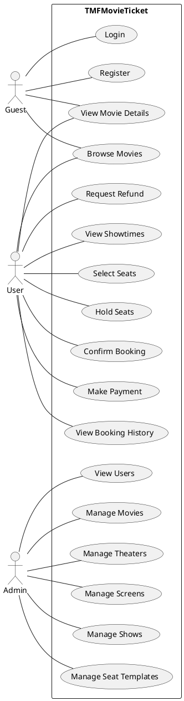
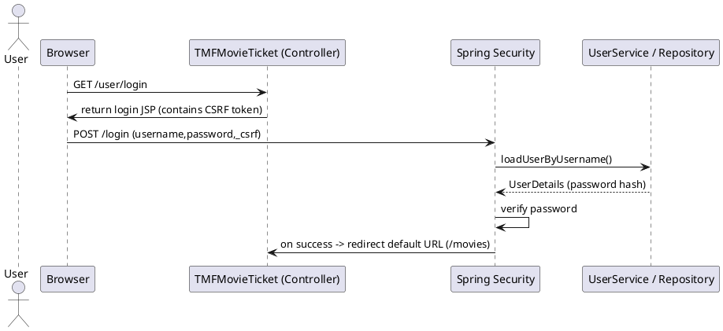
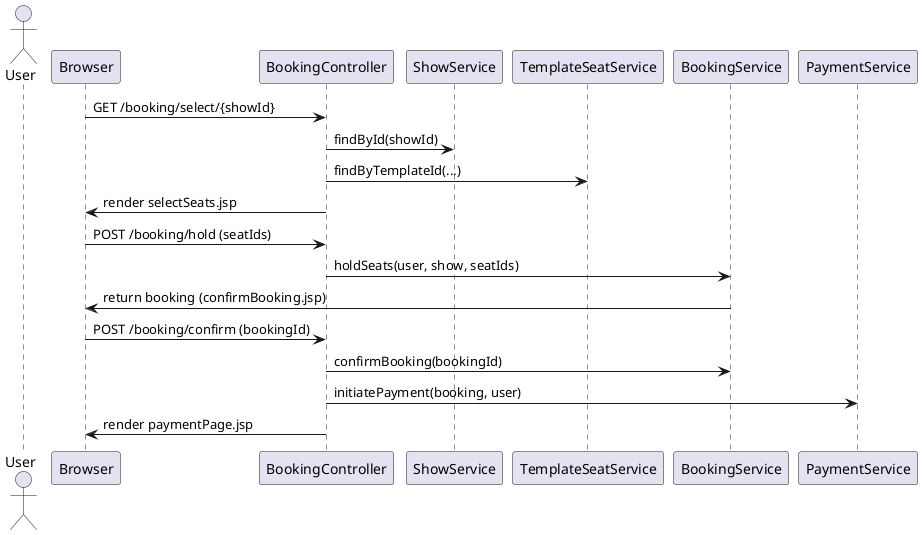
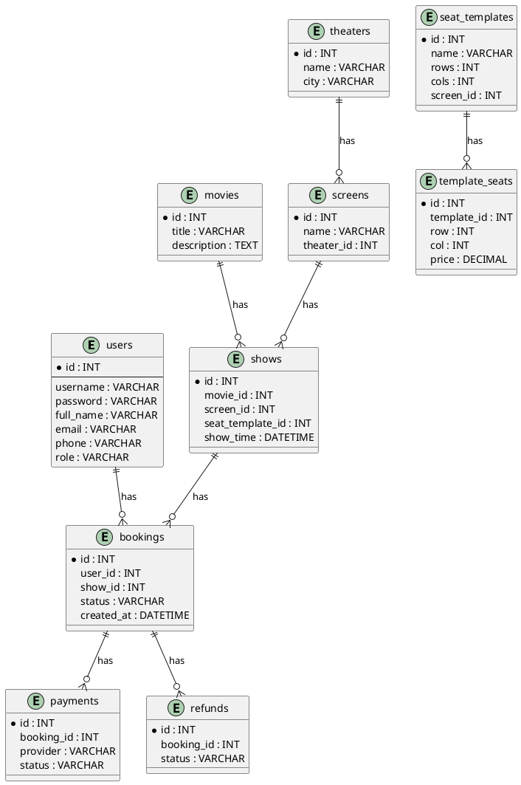

TMFMovieTicket — Project Documentation
=====================================

This document summarizes the TMFMovieTicket Spring Boot MVC web application. It includes: requirements, use cases, sequence flows, class and ER diagrams (as PlantUML text you can render), screenshots instructions, controller→view mappings, run & test steps and Git push instructions.

1. Project Overview
-------------------
TMFMovieTicket is a Spring Boot web application for browsing movies, viewing showtimes, selecting seats and booking tickets, with admin pages for managing movies, theaters, screens, shows and seat templates. It uses JSP views (under /WEB-INF/views), Spring MVC controllers, Spring Data JPA, and Spring Security for authentication.

2. Requirements List
--------------------
Functional Requirements
- User registration (username, email, password).
- User login and logout.
- View list of movies and movie details.
- View showtimes for a movie.
- Select seats for a show, hold seats and confirm booking.
- Payment initiation (placeholder for Razorpay/Stripe integration).
- View booking history and booking details.
- Request refunds and view refund status.
- Admin capabilities:
  - Manage movies (add/edit/delete)
  - Manage theaters, screens, shows
  - Manage seat templates and seat layouts
  - View and manage user list and refunds

Non-functional Requirements
- Secure authentication (Spring Security + BCrypt password encoding)
- CSRF protection enabled for forms
- Responsive, Bootstrap-based UI
- JSP view layout with header/navbar/footer and a content include
- MySQL (or H2 for dev) database via Spring Data JPA

3. Actors
---------
- Guest (anonymous visitor)
- Registered User
- Admin

4. Use Cases (text + PlantUML use-case diagram)
----------------------------------------------
Primary Use Cases (brief):
- Register
- Login
- Browse Movies
- View Movie Details
- View Showtimes
- Select Seats
- Hold & Confirm Booking
- Make Payment
- View Booking History
- Request Refund
- Admin: Manage Movies/Theaters/Screens/Shows/SeatTemplates/Users

PlantUML Use Case diagram (render with PlantUML):



5. Sequence Flow Diagrams (PlantUML)
------------------------------------
A. User login sequence



B. Booking flow (select seats -> hold -> confirm -> pay)



6. Class Diagrams (PlantUML)
----------------------------
Key domain classes (entities) and controllers/services overview.

```plantuml
@startuml
class User {
  Integer id
  String username
  String password
  String fullName
  String email
  String phone
  String role
}

class Movie { Integer id; String title; String description; }
class Theater { Integer id; String name; String city; }
class Screen { Integer id; String name; Theater theater; }
class SeatTemplate { Integer id; String name; int rows; int cols; Screen screen }
class TemplateSeat { Integer id; SeatTemplate seatTemplate; int row; int col; boolean available }
class Show { Integer id; Movie movie; Screen screen; SeatTemplate seatTemplate; LocalDateTime showTime }
class Booking { Integer id; User user; Show show; List seats; String status }
class Payment { Integer id; Booking booking; String provider; String status }
class Refund { Integer id; Booking booking; String status }

User "1" -- "*" Booking
Movie "1" -- "*" Show
Theater "1" -- "*" Screen
Screen "1" -- "*" Show
SeatTemplate "1" -- "*" TemplateSeat
Show "1" -- "*" Booking
Booking "1" -- "1" Payment
@enduml
```

7. ER Diagram (PlantUML)
------------------------



8. Screenshots
--------------
I can't take screenshots for you from this environment, but here are the exact pages to capture along with recommended steps:
- Home page: http://localhost:8081/
- Movies list: http://localhost:8081/movies
- Movie details (example): http://localhost:8081/movies/{id}
- Login: http://localhost:8081/user/login
- Register: http://localhost:8081/user/register
- Select seats: http://localhost:8081/booking/select/{showId}
- Admin movies: http://localhost:8081/admin/movies

To capture screenshots locally (Windows):
1. Open each URL in a browser.
2. Use Windows Snipping Tool or press Win+Shift+S to take a screenshot.
3. Save files with descriptive names (home.png, movies.png, login.png).

Place screenshots in the repository under `docs/screenshots/` and reference them in the submission.

9. Controller → View mapping (quick reference)
----------------------------------------------
- HomeController: / -> pages/home.jsp
- UserController:
  - GET /user/login -> pages/login.jsp
  - GET /user/register -> pages/register.jsp
  - GET /user/profile -> pages/profile.jsp
  - GET /user/list -> admin/adminUsers.jsp
- UserMovieController:
  - GET /movies -> pages/movies.jsp
  - GET /movies/{id}/shows -> pages/movieShows.jsp
- BookingController:
  - GET /booking/select/{showId} -> pages/selectSeats.jsp
  - POST /booking/hold -> pages/confirmBooking.jsp
  - POST /booking/confirm -> pages/bookingSuccess.jsp
- PaymentController: GET /payment/start/{bookingId} -> pages/paymentPage.jsp
- RefundController: GET /refunds -> pages/userRefunds.jsp ; GET /refunds/admin -> admin/adminRefunds.jsp
- Admin controllers place views under: WEB-INF/views/admin/*.jsp

10. Test data and quick run steps
--------------------------------
Pre-created dev user (see `DevUserInitializer`):
- username: testuser
- password: Test@123

How to run locally (Windows cmd):

```cmd
cd /d C:\Users\Satya\Documents\git\10259_tmf-movietktbooking\TMFMovieTicket
mvnw.cmd spring-boot:run
```
App default port: 8081 (configured in application.properties). After startup:
- Visit http://localhost:8081/
- Login at http://localhost:8081/user/login using testuser/Test@123

If you prefer to build a WAR and deploy to Tomcat:

```cmd
mvnw.cmd -DskipTests package
# deploy target/TMFMovieTicket-0.0.1-SNAPSHOT.war to your Tomcat server
```

11. Known fixes applied in this workspace (useful for your submission)
--------------------------------------------------------------------
- Fixed JSTL taglib declarations in multiple JSPs so `<c:...>` tags render correctly.
- Removed stray non-HTML content in `layout/layout.jsp` that broke JSP parsing.
- Added CSRF hidden inputs to login/register forms so Spring Security accepts POSTs.
- Ensured `UserController` login/register return the plain page views to avoid protected includes causing redirects.
- Added `SecurityConfig` wiring and ensured only one `PasswordEncoder` bean exists (SecurityBeans already provides it).
- Added a minimal `admin/adminUsers.jsp` placeholder used by admin user list view.

12. Screenshots & attachments for submission
-------------------------------------------
Include the screenshots you captured under `docs/screenshots/` and add this document `PROJECT_DOCUMENTATION.md` to your submission. If your submission platform requires a PDF, convert this Markdown to PDF (many editors/VS Code have a built-in converter or use pandoc).

13. Git repository link and push instructions
-------------------------------------------
Local repo path: `C:\Users\Satya\Documents\git\10259_tmf-movietktbooking\TMFMovieTicket`

If you haven't pushed to GitHub, do the following (replace <YOUR_REPO_URL> with the repo URL you create on GitHub):

```cmd
cd /d C:\Users\Satya\Documents\git\10259_tmf-movietktbooking\TMFMovieTicket
git init  # if not a git repo already
git add .
git commit -m "Add project and documentation"
git remote add origin <YOUR_REPO_URL>
git push -u origin main
```

Once pushed, include the URL in your submission. Example placeholder: https://github.com/<your-username>/TMFMovieTicket

14. What to include in your submission (checklist)
-------------------------------------------------
- PROJECT_DOCUMENTATION.md (this file)
- docs/screenshots/ (screenshots of the pages listed in section 8)
- link to GitHub repository containing the project
- (optional) WAR file under target/ if requested

15. Appendix: Helpful PlantUML rendering hints
--------------------------------------------
- If you want PNG/SVG outputs for diagrams, use an online PlantUML server or install PlantUML locally:
  - VS Code: install PlantUML extension, open the .puml or in-document block and preview/export.
  - Command line (with Graphviz installed):

```cmd
# Save PlantUML text to file.puml
java -jar plantuml.jar file.puml
```

Final notes
-----------
I created this document in the project root as `PROJECT_DOCUMENTATION.md`. If you want, I can also:
- Generate PNGs for the diagrams (PlantUML) and add them under `docs/diagrams/`.
- Capture and embed screenshots if you can grant remote access or paste the images here.
- Convert this doc to PDF and add it to the repo.

If you want any of those follow-ups, tell me which one and I'll do it next.
